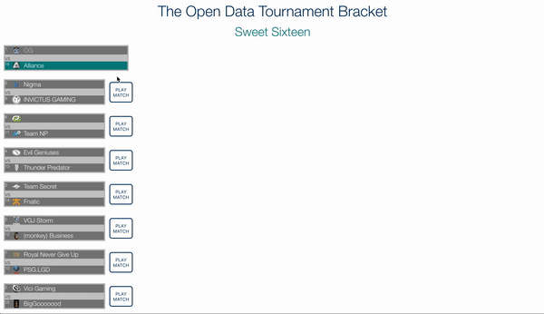

# playvs-challenge-snassau
A Tournament Challenge Using Open API

## On Opening RUN Available Scripts

In the project directory, you can run:

### `npm install`

This will install all the Node Modules.

Then... 

### `yarn build` or `npm run build`

Builds the app for production to the `build` folder. 
It correctly bundles React in production mode and optimizes the build for the best performance.

### `yarn start` or `npm start`

Runs the app in the development mode. 
Open [http://localhost:3000](http://localhost:3000) to view it in the browser.

# Description of the Tournament Challenge

The initial screen gives the user the option of how many teams should be in the tournament. The user can choose any number of teams between 2 and 100 (while the code can handle any number of teams, selecting too many teams can make the tournament unwieldy and create too many API calls). After the user submits the number of teams, this initiates an API call to the Open Data API to grab all the teams. The API request includes an array of teams. The array is arranged in order of rank, with the higher indices representing the higher the rank. Once the API calls are made, the app sends the data through a series of functions to sort the teams to their right match. If there is an uneven number of teams, or an unbalanced number of teams, the higher ranked teams earn a 'bye' in the first round. 

The user can simulate each match by clicking the button to simulate a winner. The simulated match picks a random winner, but mathmatical preference is given to the team with the higher rank. Thus the higher rank has greater chance of advancing. Once each of the games have been completed in each round, the matches for the next round will appear. 

If you click on a team name, the pertinent information for that team will appear, which includes name, logo, ranking, wins, losses and CURRENT players. 

Once all the games have been simulated a modal will appear celebrating the winner of the tournament.

##DEMO

